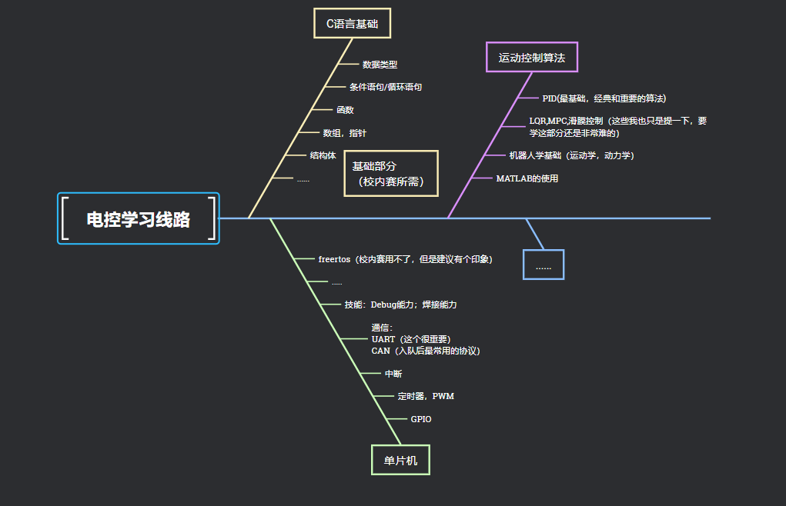

# 1.1 嵌入式物料购买及环境详细配置（Keil5）

## 硬件物材购买

1.  培训单片机最小系统板为STM32F103C8T6（注意购买的芯片是否为盗版）：建议嘉立创商城购买

    (搜索地阔星开发板）（[https://wiki.lckfb.com/zh-hans/dkx-stm32f103c8t6/beginner/](https://wiki.lckfb.com/zh-hans/dkx-stm32f103c8t6/beginner/))；                       
    
     <mark style="color:black;">PS：嘉立创开发手册中是标准库，不是我们使用的HAL库</mark>
2.  面包板(用于电气连接)，杜邦线（公对公，公对母，母对母）每种大约40根左右就很充足，

    ST-link（程序下载器）
3. 所需外设：

* 动力系统：TT电机和电机驱动模块TB6612FNG（可以先随便买一个玩，要用在车上的话需要和机械队友讨论）;舵机模块sg90;
* 通信控制系统：USB转TTL（串口模块）；蓝牙模块或者2.4G无线通信（取决于小车的控制通信方式）；
* 电源系统：电池12v;稳压模块（12V转5V；12V转3.3V都要具备）

## Keil5 环境配置

学习嵌入式主要需要用到Keil5和STM32CUBEMX

一. 安装Keil5：

1\. 下载群文件《新人电控一整套》

2\. 解压该文件：解压密码：fanbaomiaomiao

3\. 安装MDK：点击运行MDK535.EXE文件

<figure><figcaption></figcaption></figure>

4\. 在弹出的界面，点击NEXT

<figure><figcaption></figcaption></figure>

5\. 勾选I agree，点击Next

<figure><figcaption></figcaption></figure>

6\. 记住界面弹出的默认安装的路径，点击Next。在这里有两个注意事项：1.安装路径里面不要有中文！2.不要安装在C:\Program Files这个文件夹里！

<figure><figcaption></figcaption></figure>

补充事项：如果想更改安装位置，点击右边的\[Browse]，更改的时候也要记住更改的位置，Core和Pack都要记住。

7\. 填写用户信息，可以随便填写；点击Next

<figure><figcaption></figcaption></figure>

8\. 等待keil5的安装

<figure><figcaption></figcaption></figure>

9\. 安装完成后，在弹出的界面中点击Finish

<figure><figcaption></figcaption></figure>

10\. 关闭弹出来的Pack Installer窗口：关掉它

<figure><figcaption></figcaption></figure>

11\. 激活MDK：在桌面上右击keil图标，在弹出的选项卡中选择<mark style="color:;">以管理员身份运行</mark>（很重要很重要！！！）

<figure><figcaption></figcaption></figure>

12\. 点击File，选择License Management

<figure><figcaption></figcaption></figure>

13\. 复制CID

<figure><figcaption></figcaption></figure>

14\. 在安装文件中点击keygen.exe文件（运行前一定静音！！！！！，喜欢刺激的同学可以把声音调到最大）

<figure><figcaption></figcaption></figure>

15\. 粘贴复制过的CID，选择Target为ARM，点击Generate，生成激活码

<figure><figcaption></figcaption></figure>

16\. 复制生成的激活码，粘贴在New License ID Code处，点击Add LIC，即可成功激活mdk，显示mdk的使用期限

<figure><figcaption></figcaption></figure>

17\. 在安装文件中点击Keil.STM32F1xx\_DFP.1.1.0.pack

<figure><figcaption></figcaption></figure>

18\. 点击Next 进行安装，安装完成后，点击Finish

<figure><figcaption></figcaption></figure>

<figure><figcaption></figcaption></figure>

19\. 到此keil5就成功安装并激活了！

二、安装STM32CUBEMX

1.首先需要安装java环境，运行这个jre开头的文件，完成安装即可，安装路径不要有中文

<figure><figcaption></figcaption></figure>

2.安装完Java后，运行这个Setup开头的文件，完成安装即可，安装路径不要有中文

<figure><figcaption></figcaption></figure>

3.安装这一步时直接默认即可。

&#x20;

<figure><figcaption></figcaption></figure>

4.java和cubemx的具体安装过程可以参考：[STM32CubeMX 下载及安装教程\_Brendon\_Tan的博客-CSDN博客](https://blog.csdn.net/Brendon_Tan/article/details/107685563)   第三部分：

<figure><figcaption></figcaption></figure>

欧克，到这里Keil5和STM32CUBEMX就全部安装完了！

## 驱动安装

设备是通过不同的通信协议来与电脑进行连接，这就要求我们安装驱动程序

有时在设备管理器里查找不到自己连接的器件，这时就要去寻找自己是否安装对应的驱动程序

一般的驱动包含：

* ST-LINK下载器的驱动程序
* USB装TTL串口模块驱动
* ......

