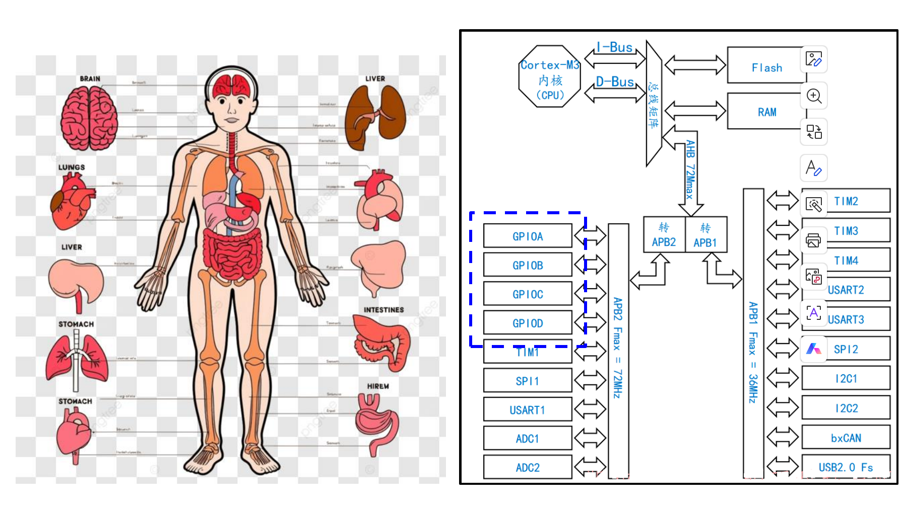
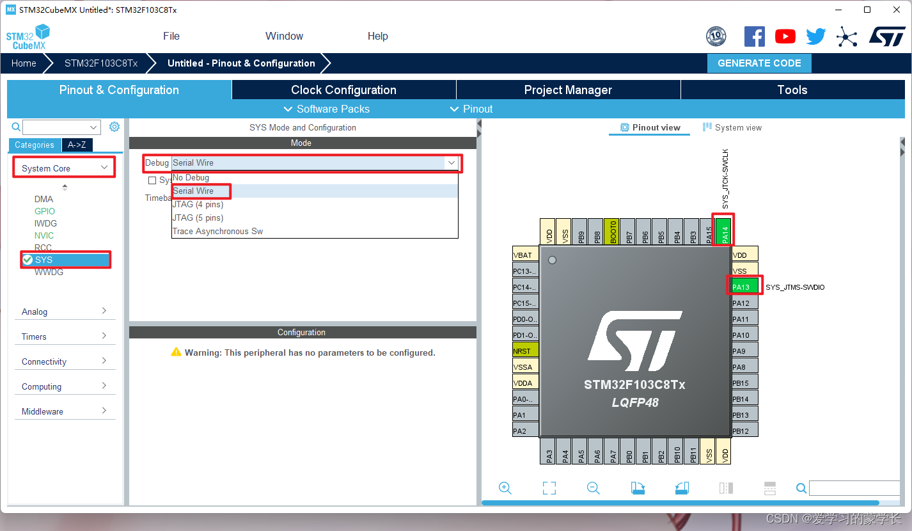

# 使用GPIO点亮板载LED

## 认识时钟

时钟，是STM32单片机以及各种设备的心跳，

-   时钟信号是一种高低电平交替变化的脉冲信号。每一次变化（比如从低到高）都代表单片机完成了一个最基本的动作（比如处理一次指令、移动一次数据）。
-   时钟频率（单位是Hz）决定了单片机运行的快慢。比如8MHz，意思是每秒有800万次“鼓点”。频率越高，单片机工作越快。
-   单片机要按照一定的顺序来完成各种任务，这就需要有一个统一的“节拍”。时钟让所有部件步调一致，不会乱套。

有低速高速两种（High Speed，HS与Low Speed，LS），低速用于实时时钟（Real Time Clock，RTC）等。

高速用于定时器、UART、ADC等多种外设。

时钟与外设使用 总线连接，外设总线：包括APB1和APB2。


在Cubemx中可以清楚看到时钟总线分配给各种外设。

## 认识GPIO

### GPIO综述




GPIO（General Purpose Input/Output，通用输入输出口）可以类比为人体的“手和脚”等，可以与外界进行交互。

从上图可以看到此款单片机的四种GPIO（PA,PB,PC,PD）都是挂载在APB2时钟上的。在cubemx中，我们可以配置GPIO的工作模式以让其发挥我们想要的功能。

### GPIO的八种工作模式

#### 

#### 输出模式VS输入模式


”写“可以理解为将此引脚置为高电平；”读“可以理解为感应此引脚的电平。

#### 推挽模式（Push-Pull）VS开漏模式（Open-Drain）

推挽模式

-   推挽模式下，GPIO端口内部有两个晶体管，一个连接电源，一个连接地。
-   当输出高电平时，上方晶体管导通，端口直接输出电源电压（如3.3V或5V）。
-   当输出低电平时，下方晶体管导通，端口直接输出地（0V）。
-   能够主动输出高、低电平，驱动能力强，适合直接驱动LED、继电器等负载。
-   **==宁折不弯，推挽高低电平相遇会烧坏==**

开漏模式

-   开漏模式下，GPIO端口内部只有一个下拉晶体管，连接地。
-   当输出低电平时，晶体管导通，端口接地（0V）。
-   当输出高电平时，晶体管关闭，端口处于悬空（不输出电压），需要外部上拉电阻将端口拉到高电平。
-   ==不能主动输出高电平，只能“拉低”或“释放”。==

#### 复用VS通用


从上图可以看出通用输出是由CPU直接控制引脚；复用输出用于外设对引脚有特殊要求（绑定了特定MCU内功能输出），其实就是用作其他外设的专用引脚。

#### 输入的四种模式


输入上拉和下拉就是默认状态下该引脚的电平为高电平3.3V，0V。

浮空输入模式下，电平的状态飘忽不定，测量时可能出现0~3.3V之间的任意电压值。

输入模拟与前三种输入模式不同，它是唯一可以读取模拟量（即连续时间连续值），其他都是数字信号输入。

## 点亮单片机板载LED

首先当我们想要完成某一个功能时，一定要有理论知识去支撑我们完成这个功能，那么我们需要知道点亮LED灯的原理，知道原理后我们才能有根据的配置32单片机外设和编写代码。

#### LED原理

LED在这里是指发光二极管，二极管导通的条件是给其施加一个正向电压就行。


如上图所示，我们需要配置好一个电子回路。该庆幸的是板载最小系统板在设计的时候就已经有帮我们设计好了的电路。


如上图，D1在系统板上电是就会一直处于导通状态，而D2的状态完全处于PC13，所以接下我们要做的的就是控制PC13引脚进而控制D2的状态。

#### CubeMX的工程配置

[STM32F103C8T6基础开发教程（HAL库）—点亮第一颗LED灯_stm32f103c8t6 教程-CSDN博客](https://blog.csdn.net/qq_38191568/article/details/126021237)

具体操作可以看这篇博客，操作基本都有讲解。

**==PS：自己的LED引脚可能与这篇文章作者不同，请根据实际情况来操作==**

==•Keil中，取消编译优化，打开C99，以及—cpp11==

==•Reset and run==

在这里点一下最重要，也是基本每次配置工程都会用到的两步



选择调试模式，如果不选你无法使用stlink这类下载工具；


选择时钟源

#### 代码编写

```
  while (1)
  {
    /* USER CODE END WHILE */
			HAL_GPIO_WritePin(LED_GPIO_Port,LED_Pin,GPIO_PIN_SET);//用户编写的只有这个一段代码实现灯常亮
//			GPIOx：对应的 GPIO 端口。例如 LED_GPIO_Port 可能是 GPIOA、GPIOB 等。
//			GPIO_Pin：要操作的引脚。例如 LED_Pin，一般是类似 GPIO_PIN_1、GPIO_PIN_5 这样的宏。
//			PinState：设置引脚的电平状态。可以是：
//			GPIO_PIN_SET：将引脚设置为高电平（输出为 1）
//			GPIO_PIN_RESET：将引脚设置为低电平（输出为 0）
	HAL_Delay(1000);//延时函数，单位为ms,这里起到的作用是使led灯一秒改变一次状态;
    /* USER CODE BEGIN 3 */
  }
```


