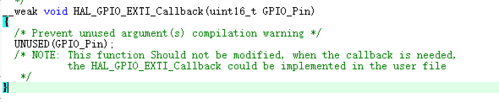
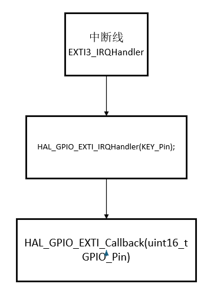

# 外部中断EXTI

## 单片机执行原理（暂时看不懂没事）

从抽象上看，==处理器系统==是一台能运算数据、操控内部状态、处理外部事件并与外部设备通信的机器。它的一切能力都依赖于代码，而代码由“指令”和“数据”构成；指令决定“做什么”，数据决定“用什么做”。

这些指令与数据都存放在==存储器==中。存储器按地址顺序编排，像在 C 语言里用指针访问内存那样可以被直接访问。它既能存放可执行的指令，也能保存运行时的数据；其中一部分地址被保留映射为寄存器空间，用于连接和控制外部设备，例如通信模块、调试组件或附加存储器。处理器通过访问存储器取回指令编码与数据，配合内部电路完成运算与状态更新，并将结果输出到外部世界。

然而，世界并不总按既定节拍运行。如果——我只是说如果——外部突然发生了意想不到的事件，带来了出乎意料的信息，处理器该如何即时应对？这便引出了下面要讲的核心机制——==中断==。它允许外部事件“打断”当前执行，转入专门的处理流程，以最快的方式给出响应。

## 怎样理解中断

清晨，工位灯亮起，白板上写着今天的主计划：加工云台支架→装配底盘→校准电机→联调发射机构（主程序/主循环）。lzc戴上手套拧上扭矩扳手，流程稳步推进：测量、钻孔、攻丝、装配（顺序执行）。

忽然，对讲机里传来“场地紧急停机！”（中断源，且为高优先级中断）。lzc立刻在工单上记下当前步骤、扭矩值与零件编号，等于给任务夹上书签（保存现场/入栈），小跑去测试场地，开始快速处置（进入==中断服务程序==/ISR）。他处理完问题在记录表上把这次警报打勾（清中断标志），随后回到工位按“书签”继续拧完那一颗螺丝（出栈返回/恢复现场）。

不一会儿，手机弹出取件码：定制齿轮到了（中断源，低优先级中断）。lzc暂停一下去门口签收、入库并贴标签（ISR只做关键动作），把“尺寸复检与啮合测试”留回主流程再做（回到主程序/主循环）。

签收途中，裁判系统终端又报警：某车小陀螺疯转（中断源，更高优先级中断），直接打断了刚才的快递流程（优先级与嵌套/NVIC）。lzc立刻赶到场边，用毯子将车逼停，随后把这件事压力给电控（清中断标志），再返回把快递流程收尾（出栈返回/恢复现场），最终回到装配主线（主程序/主循环）。

下午联调时，供弹扳机偶尔“连动两下”误报（抖动干扰）。lzc没有在ISR里大动干戈，只记录一次事件并清标志（ISR要短小+清中断标志），随后压力电控在主流程里加电容与软件滤波（去抖动），把“更换按钮/优化线束”安排成后续任务（主程序/主循环处理耗时工作）。

准备做关键总装扭矩前，他把手机与IM系统设为“仅安全员和测试台可打断”（屏蔽/使能中断），避免低优先级事务干扰；完工后再恢复正常通知（重新使能中断）。

一句话收束：机械组的一天，就是单片机中断的现场版——主计划稳步推进（主程序/主循环），突发情况按轻重插队（优先级与嵌套/NVIC）；先记书签（保存现场/入栈），快进快出处理（ISR要点+清中断标志），再回到正事（出栈返回/恢复现场）；必要时开“勿扰”（屏蔽/使能中断），偶发抖动就滤掉（去抖动）。

```
void Mech_Init(void);
void NVIC_Config(void);

void Assemble_Gimbal(void);
void Assemble_Chassis(void);
void Calibrate_Motors(void);


int main(void)
{
    Mech_Init();      // 机械组资源初始化（工装、工具、日志、台架…）
    NVIC_Config();    // 配置中断优先级与使能（仅示意）

    while (1)
    {
        Assemble_Gimbal();    // 装配/调校云台
        Assemble_Chassis();   // 装配底盘
        Calibrate_Motors();   // 校准电机
        
    }
}

void EmergencyStop_IRQHandler(void);   // 急停（高优先级）
void Alert_IRQHandler(void);       // 小陀螺异常
void PackageArrived_IRQHandler(void);  // 快递到货（低优先级）
```

## 工程配置

内容：完成使用按键控制LED的状态

在上次配置的基础上：

•根据原理图或PCB图，找到开发板上按键开关对应的单片机引脚。本系列教程STM32CubeMX基础实验采用的开发板中，按键开关对应的引脚为PB3

•将PB3设置为外部中断3号通道

•检测模式选择下降沿

•输入模式选择上拉输入，用于维持平时的高电平

•使能嵌套中断向量控制器

中断的两种优先级默认配置即可


硬件连接：


## 代码讲解

```
/* USER CODE BEGIN 4 */
void HAL_GPIO_EXTI_Callback(uint16_t GPIO_Pin) //中断回调函数
{
	switch(GPIO_Pin)
	{
		case KEY_Pin://检测是哪一个引脚发生了外部中断
			HAL_GPIO_TogglePin(LED_GPIO_Port,LED_Pin);
			break;
		default:
			break;
	}
}
/* USER CODE END 4 */
```

### 虚函数VS实函数



#### __weak

•本质上是一个宏定义

•实际上的文本对应是编译指令__attribute__((weak))

#### 虚函数

•有虚函数指令__weak的函数声明

•虚函数可以有很多个

#### 实函数

•没有虚函数指令__weak的函数声明，也就是普通的函数，都是实函数

•实函数至多有一个，多了会编译报错（如果是C++可以兼容函数重载）

•如果实函数存在，则用实函数

•如果实函数不存在，则随机选取一个幸运的虚函数（对我们而言是随机的，但对于编译器而言，也是有一定规则选取的）

### 程序流程



```
/******************************************************************************/
/* STM32F1xx Peripheral Interrupt Handlers                                    */
/* Add here the Interrupt Handlers for the used peripherals.                  */
/* For the available peripheral interrupt handler names,                      */
/* please refer to the startup file (startup_stm32f1xx.s).                    */
/******************************************************************************/

/**
  * @brief This function handles EXTI line3 interrupt.
  */
void EXTI3_IRQHandler(void)//
{
  /* USER CODE BEGIN EXTI3_IRQn 0 */

  /* USER CODE END EXTI3_IRQn 0 */
  HAL_GPIO_EXTI_IRQHandler(KEY_Pin); 处理外部中断线（EXTI）的 HAL 函数，在cubemx中配置后生成的，不是我们编写的
  /* USER CODE BEGIN EXTI3_IRQn 1 */

  /* USER CODE END EXTI3_IRQn 1 */
}
```

```
/**
  * @brief  This function handles EXTI interrupt request.
  * @param  GPIO_Pin: Specifies the pins connected EXTI line
  * @retval None
  */
void HAL_GPIO_EXTI_IRQHandler(uint16_t GPIO_Pin)//检查是否发生外部中断，调用中断回调函数
{
  /* EXTI line interrupt detected */
  if (__HAL_GPIO_EXTI_GET_IT(GPIO_Pin) != 0x00u)//获取是否触发中断
  {
    __HAL_GPIO_EXTI_CLEAR_IT(GPIO_Pin);//清除中断标志位
    HAL_GPIO_EXTI_Callback(GPIO_Pin);//调用中断回调函数
  }
}
```

```
/**
  * @brief  EXTI line detection callbacks.
  * @param  GPIO_Pin: Specifies the pins connected EXTI line
  * @retval None
  */
__weak void HAL_GPIO_EXTI_Callback(uint16_t GPIO_Pin) //虚函数，需要重新定义
{
  /* Prevent unused argument(s) compilation warning */
  UNUSED(GPIO_Pin);
  /* NOTE: This function Should not be modified, when the callback is needed,
           the HAL_GPIO_EXTI_Callback could be implemented in the user file
   */
}
```

```
void HAL_GPIO_EXTI_Callback(uint16_t GPIO_Pin)//自己实现的实函数
{
	switch(GPIO_Pin)
	{
		case KEY_Pin:
			HAL_GPIO_TogglePin(LED_GPIO_Port,LED_Pin);
			break;
		default:
			break;
	}
}
```

前三段代码都不是自己要写的，都是在CubeMX中配置完就可以直接生成出来的配置代码。