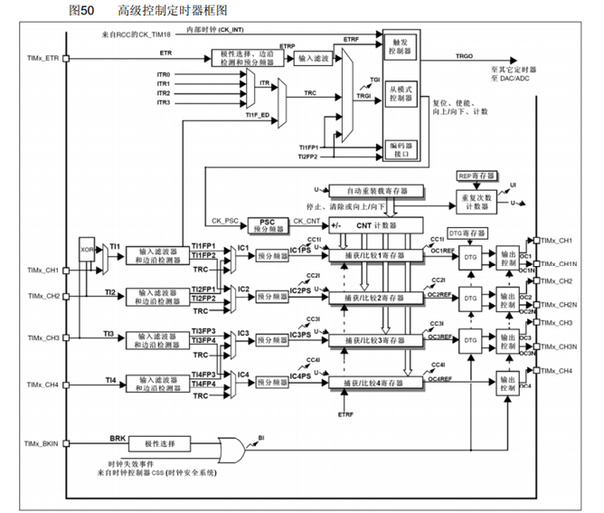

# 认识定时器
## 基本概述
定时器（Timer/Counter）是微控制器中负责计时和计数的硬件模块。它通过一个时钟源进行递增或递减计数，用以产生精确的时间间隔、测量事件间隔或生成周期性波形。

### 主要组成部分：
- 时钟源（内部系统时钟或外部时钟）
- 分频器（Prescaler）
- 计数寄存器（Counter/Timer Register）
- 比较/捕获寄存器（Compare/Capture Registers）
- 中断/事件控制逻辑。

## 常见工作模式：
- **基本计数/溢出模式**（Normal/Overflow）：计数器递增到最大值后溢出并归零，通常产生溢出中断用于周期性任务。
- 比较匹配（CTC/Compare）：当计数值等于比较寄存器时触发事件或中断，便于产生精确定时或定时复位。
- **PWM（脉宽调制）模式**：计数器与比较寄存器配合，通过改变“高电平持续时间”占空比来生成用于驱动电机或调光的PWM信号。
- 输入捕获（Input Capture）：记录外部事件发生时的计数值，用于测量脉宽或频率。
- 外部触发/同步模式：允许外部信号启动、停止或同步计数。
### 计数模式
通用定时器有向上计数、向下计数、向上向下双向计数模式。

- 向上计数模式：计数器从0计数到自动加载值（TIMx_ARR），然后重新从0开始计数并且产生一个计数器溢出事件。
- 向下计数模式：计数器从自动装入的值（TIMx_ARR）开始向下计数到0，然后从自动装入的值重新开始，并产生一个计数器向下溢出事件。
- 中央对齐模式（向上/向下计数）：计数器从0开始计数到自动装入的值-1，产生一个计数器溢出事件，然后向下计数到1并且产生一个计数器溢出事件；然后再从0开始重新计数。

简单地理解三种计数模式，可以通过下面的图形：

