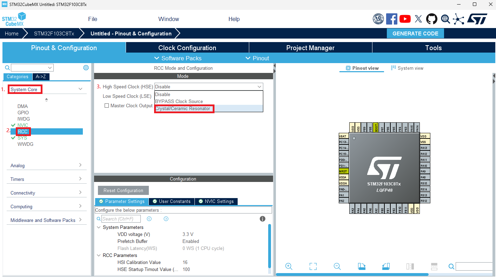
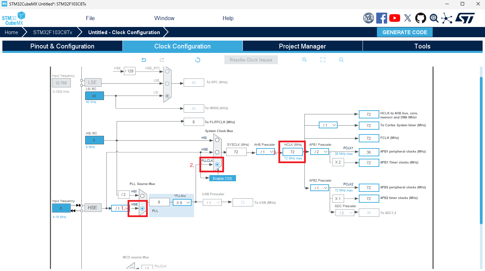
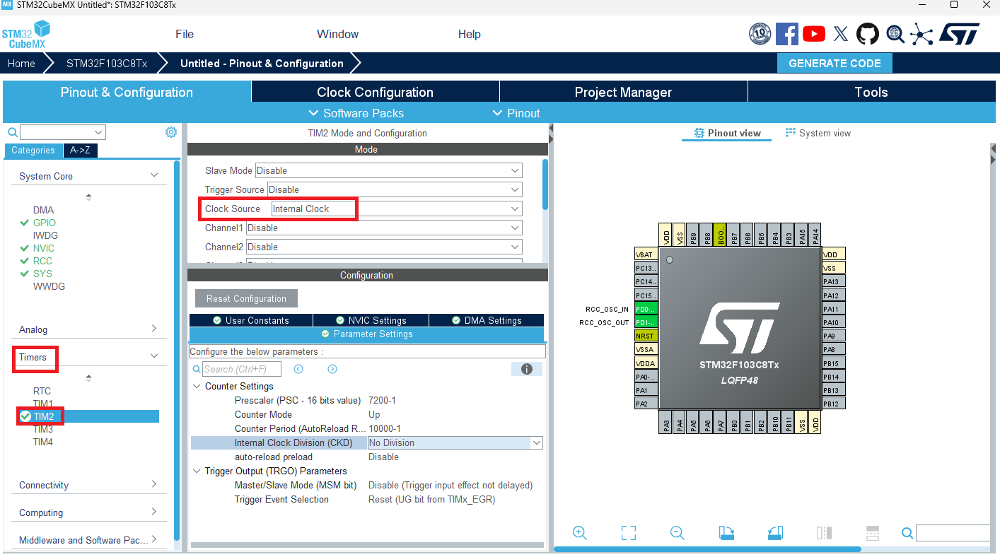

# 定时器中断
## 为什么要使用定时器中断？
想象你的手机里装了一个超级可靠的小闹钟——它会在你设置的时间“悄悄”提醒你：该起床了、该吃饭了、该打游戏了。定时器中断就是这样一个闹钟：当时间到或发生特定事件时，它会立刻“敲门”告诉CPU，“嘿，有事儿要处理！”CPU会暂时放下当前任务，去处理这个“敲门”的事情（运行中断服务程序，简称ISR），处理完再继续未完成的工作。

定时器中断最大的好处就是​​高效​​。如果没有它，想让一个LED灯每秒闪烁一次，CPU就只能不断地查询时间：“到1秒了吗？到1秒了吗？”，在这段时间里它什么别的也干不了，这被称为“忙等待”或“死等”，效率极低。

而有了定时器中断，CPU就可以​​“一心二用”​​。在定时器默默计时的背景之下，CPU可以腾出精力去执行其他任务，只在需要的时候被“打断”一下去处理定时任务。这样就极大地提高了单片机的工作效率。

总而言之，定时器中断就是一个让单片机能够高效、精准地处理时间相关任务的幕后功臣。
## 怎样使用定时器中断？
### 配置时钟树
这一部分的原理不做过多介绍，感兴趣的同学可以自行查看
[时钟树配置视频](https://www.bilibili.com/video/BV1nf42197u9?vd_source=6648c7dead172f277d7550186c8b0233)

我们打开上一次的工程，选择System Core,选择RCC,将High Speed Clock改为Crystal/Ceramic Resonator。

然后选择Clock Configuration,选择HSE,选择PLLCLK,将HCLK改为72MHz,软件会自动帮我们完成其他配置。

### 配置定时器
选择左侧栏中的Timers,选择TIM2，将Clock Source选择为Internal Clock

我们选择让定时器定时一秒，定时器周期可由如下公式获得：

**T = (psc+1)(arr+1)/fclk**

在Configuration栏中对定时器预分频系数和自动重装载值进行配置，选中Prescaler将其更改为7200-1,选中Internal Clock Division将其更改为10000-1


选中NVIC Settings,勾选TIM2 global interrupt Enabled，以打开定时器中断

### 编写定时器中端处理程序
将以下程序添加到main.c中，程序将在执行完中断后进入此中断处理函数，实现A1端口的翻转。
```C
void HAL_TIM_PeriodElapsedCallback(TIM_HandleTypeDef *htim)
{
    if (htim == (&htim2))
    {
        HAL_GPIO_TogglePin(GPIOA,GPIO_PIN_8);
    }
}
```
### 在主程序中开启定时器
定时器只有经过使能才能开始工作，stm32 hal库中，开启定时器中断的函数如下：
```C
HAL_StatusTypeDef HAL_TIM_Base_Start_IT(TIM_HandleTypeDef *htim);
```
我们在主函数的开始调用该函数使能定时器，就能使定时器开始工作，并以我们设定的周期进入中断处理函数，实现GPIO口的电平翻转
```C
int main(void)
{
  ...
  /* USER CODE BEGIN 2 */
  HAL_TIM_Base_Start_IT(&htim2);
  /* USER CODE END 2 */

  /* Infinite loop */
  /* USER CODE BEGIN WHILE */
  while (1)
  {
    /* USER CODE END WHILE */

    /* USER CODE BEGIN 3 */
  }
  /* USER CODE END 3 */
}
```
效果如下：
<video id="video1" controls="" preload="none" poster="../photo/assets/2.1.13.png">
      <source id="mp4" src="../photo/assets/video_20251017_221002.mp4" type="video/mp4">
</videos>
