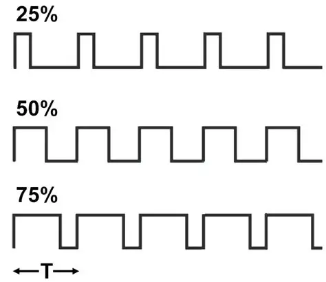
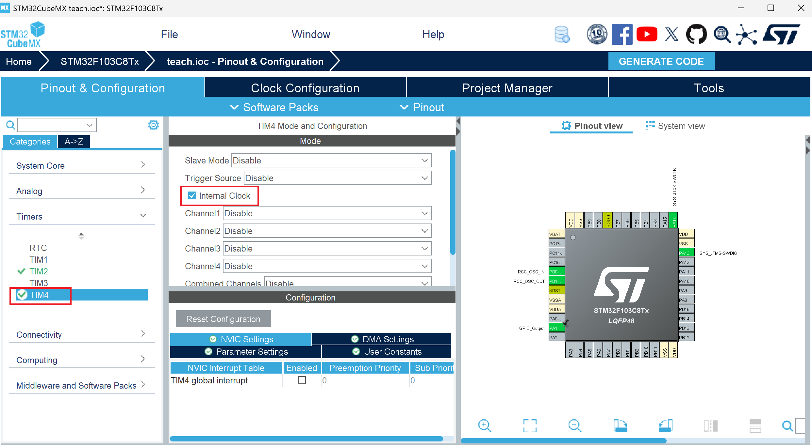
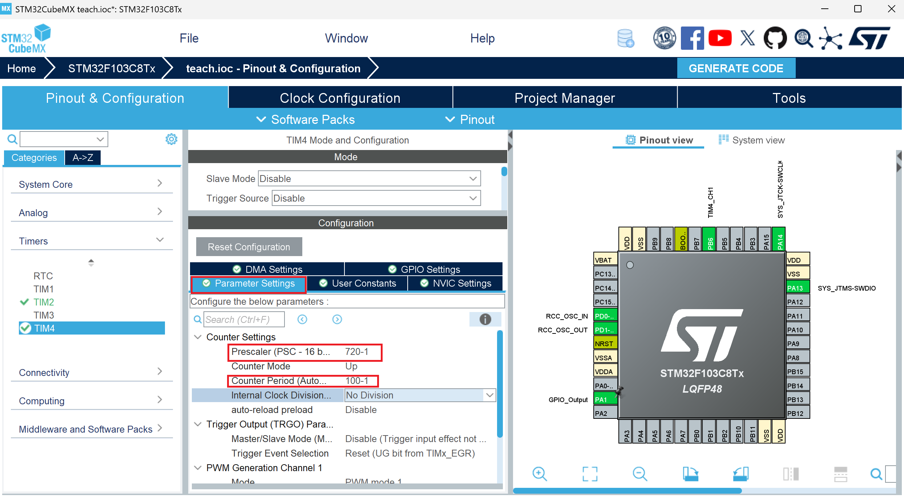
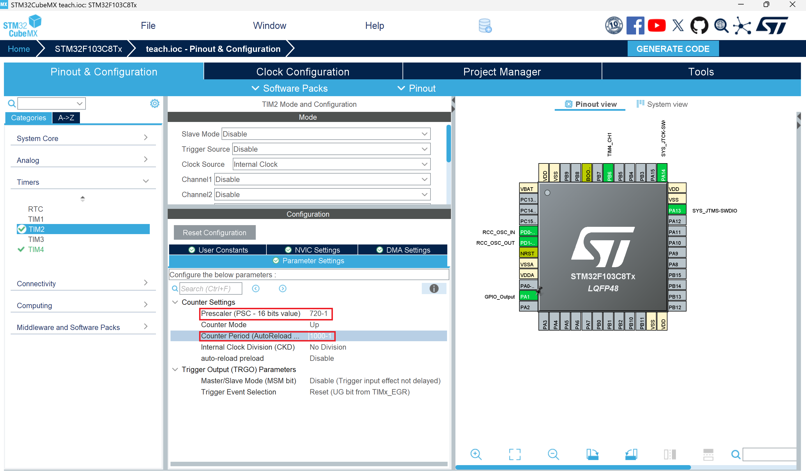

# PWM波输出
## 什么是PWM
脉冲宽度调制(PWM)，是英文“Pulse Width Modulation”的缩写，简称脉宽调制，是利用微处理器的数字输出来对模拟电路进行控制的一种非常有效的技术，广泛应用在从测量、通信到功率控制与变换的许多领域中。

简单来说，pwm就是如上图所示的方波。

为什么需要 PWM？

设想你要控制电机速度或调节灯的亮度。直觉上，常见的做法是改变电压：电压越高，输出能量越大，设备响应越强。但单片机的 GPIO 通常只能输出两个数字电平（如 0V 与 3.3V/5V），无法直接输出连续的模拟电压；虽然可以用 DAC，但成本和资源开销较大。

PWM 提供了一种低成本且高效的替代方式：通过在固定频率下改变“高电平持续时间”的比例（占空比），在时间上调节输出能量的平均值。这样，外部负载（如电机或 LED）看到的是一个平均能量，而不是连续变化的电压。
## 怎样输出PWM
我们打开上次定时器中断的工程，选择TIM4,勾选Ineteral Clock

选择Channel1 的PWM Generation CH1

选择Prescaler,将其更改为720-1；选择Counter Period，将其更改为100-1,根据公式：

**T = (psc+1)(arr+1)/fclk**

可知我们设置的pwm频率为1khz

然后修改TIM2的Prescaler及Counter Period如下：

通过上述修改，定时器中断的周期变为10ms。
点击Generate Code并进入keil工程，在main函数中添加pwm使能代码如下：
```C
int main(void)
{
    ...
  /* USER CODE BEGIN 2 */
  HAL_TIM_Base_Start_IT(&htim2);
  HAL_TIM_PWM_Start(&htim4,TIM_CHANNEL_1);
  /* USER CODE END 2 */

  /* Infinite loop */
  /* USER CODE BEGIN WHILE */
  while (1)
  {
    /* USER CODE END WHILE */

    /* USER CODE BEGIN 3 */
  }
  /* USER CODE END 3 */
}
```
## 怎样修改占空比
我们通过修改CCR的方式对输出pwm波的占空比进行修改，
所用到的函数如下:
```C
__HAL_TIM_SetCompare(&htim4, TIM_CHANNEL_1, pwmVa);
```
其中，第一个参数是输出pwm所用的定时器，第二个参数是输出pwm的通道，第三个参数是所要修改的CCR值。其中占空比的公式为：

**Duty = CCR / (ARR + 1)**

## PWM控制呼吸灯
基于上节课实现的定时器中断以及这节课的PWM输出，我们可以实现呼吸灯的效果，即随着时间变化，pwm输出占空比不断变化，实现led亮暗的转换。

我们先在main.c的上方添加tim4_channel1_pulse、tim4_channel1_pulse_dir的定义，以存储CCR值、控制pulse增加减少方向如下：
```C
uint8_t tim4_channel1_pulse = 0;
uint8_t tim4_channel1_pulse_dir = 0;
```
接着在上节课使用过的中断回调函数HAL_TIM_PeriodElapsedCallback中添加如下代码：
```C
void HAL_TIM_PeriodElapsedCallback(TIM_HandleTypeDef *htim)
{
    if (htim == (&htim2))
    {
        HAL_GPIO_TogglePin(GPIOA,GPIO_PIN_8);
		if(tim4_channel1_pulse_dir == 0)
		{
			tim4_channel1_pulse++;
		}					
        else
		{
			tim4_channel1_pulse--;
    	}
				
		if(tim4_channel1_pulse>=100)
		{
			tim4_channel1_pulse_dir = 1;
		}
		else if(tim4_channel1_pulse<=0){
		    tim4_channel1_pulse_dir = 0;
		}
        __HAL_TIM_SET_COMPARE(&htim4,TIM_CHANNEL_1,tim4_channel1_pulse);
			  
    }
}
```
效果如下：
<video id="video2" controls="" preload="none" poster="">
      <source id="mp4" src="../.gitbook/assets/video_20251017_222434.mp4" type="video/mp4">
</videos>


