# **通信模式**

## **🧩 一、通信的目的与协议**

### **通信的目的**：  

👉 将一个设备的数据发送到另一个设备，实现**信息交互**或**硬件扩展**。  
比如：主控 MCU 读取传感器数据，或与电脑交换数据。

### **通信协议**：  

👉 制定通信双方的**规则**（格式、时序、电平等），  
使得双方能**按照统一标准**正确地收发数据。

| 名称  | 引脚                 | 双工   | 时钟 | 电平 | 设备结构 |
| ----- | -------------------- | ------ | ---- | ---- | -------- |
| USART | TX、RX               | 全双工 | 异步 | 单端 | 点对点   |
| I2C   | SCL、SDA             | 半双工 | 同步 | 单端 | 多设备   |
| SPI   | SCLK、MOSI、MISO、CS | 全双工 | 同步 | 单端 | 多设备   |
| CAN   | CAN_H、CAN_L         | 半双工 | 异步 | 差分 | 多设备   |
| USB   | DP、DM               | 半双工 | 异步 | 差分 | 点对点   |

-   全双工：可以同时发送和接收；像打电话，两人能同时说、同时听

-   半双工：不能同时进行，只能一方发、一方收；不能同时进行，只能一方发、一方收

-   异步：无独立时钟线，双方各自时钟

-   同步：有独立时钟线，主设备提供


## **串口通信：**

### 参数及时序

-   波特率：串口通信的速率

-   起始位：标志一个数据帧的开始，固定为低电平

-   数据位：数据帧的有效载荷，1为高电平，0为低电平，低位先行

-   校验位：用于数据验证，根据数据位计算得来

-   停止位：用于数据帧间隔，固定为高电平


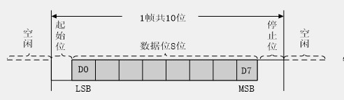

### **STM32CubeMx的具体配置**

1.设置RCC

**设置高速外部时钟HSE 选择外部时钟源**

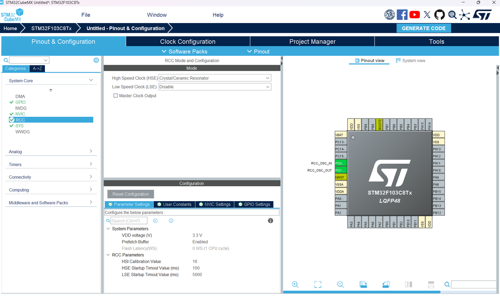

2.设置烧录口

**设置Debug: Serial Wire**

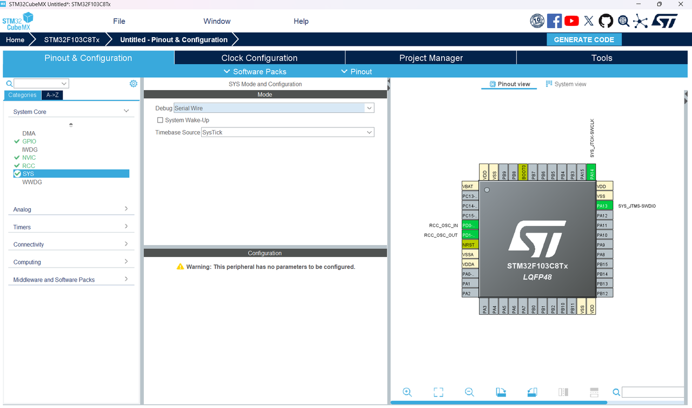

3.设置串口

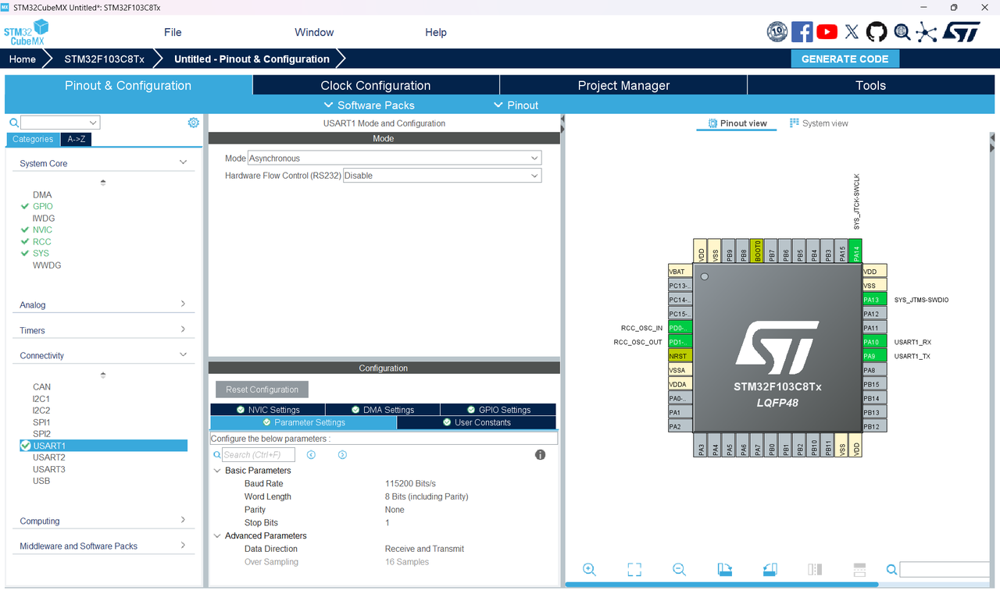

-   1点击USATR1

-   2设置MODE为异步通信(Asynchronous)

-   3基础参数：波特率为115200 Bits/s。传输数据长度为8 Bit。奇偶检验无，停止位1 接收和发送都使能
-   4GPIO引脚设置 USART1_RX/USART_TX
-   5 NVIC Settings 一栏使能接收中断

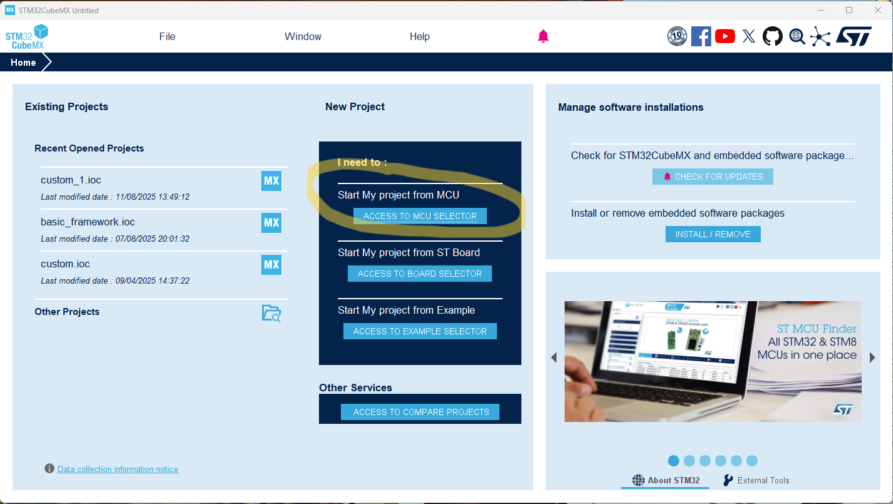

4.设置时钟

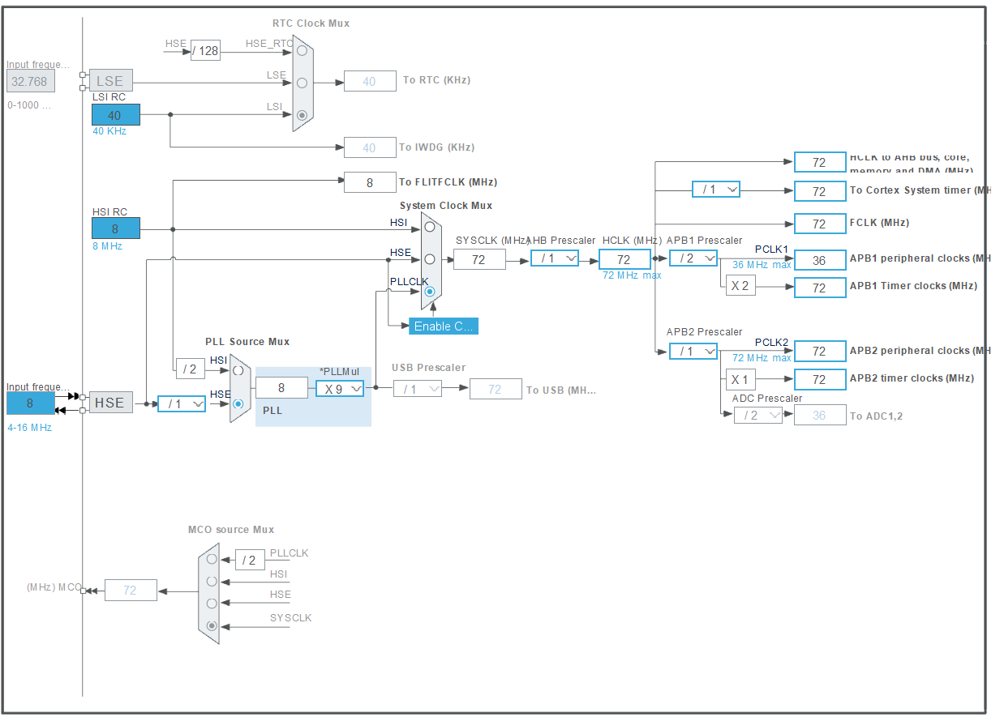

注：这里输入72就可以了

5.项目文件设置

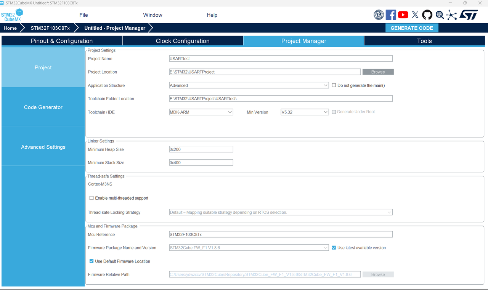

-   1 设置项目名称
-   2 设置存储路径

-   3 选择所用IDE

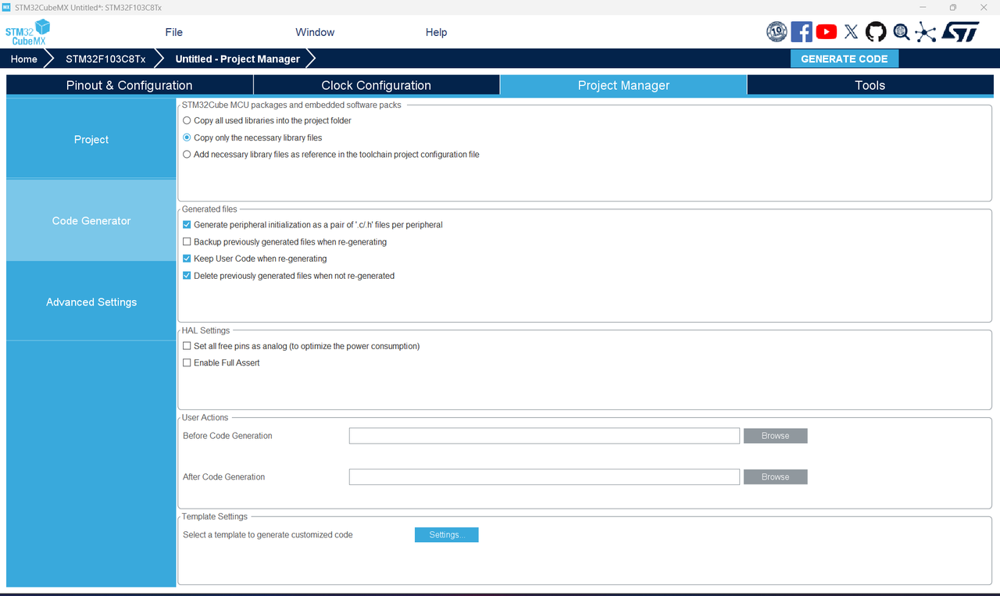

6.创建工程文件

然后点击**GENERATE CODE** 创建工程

### **配置下载工具**

新建的工程所有配置都是默认的 我们需要自行选择下载模式，勾选上下载后复位运行

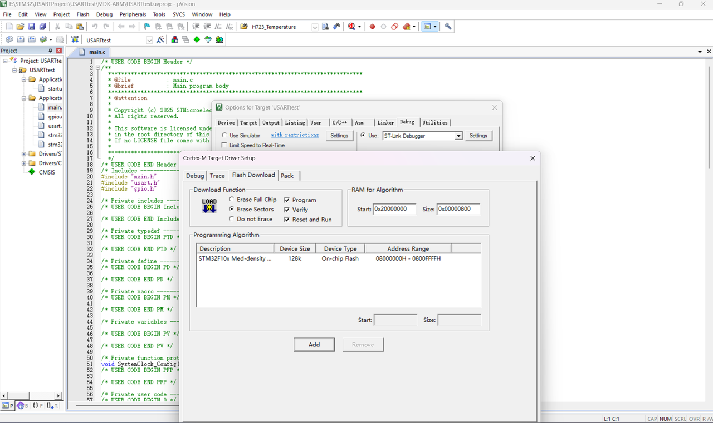

修改代码优化等级：选择不优化

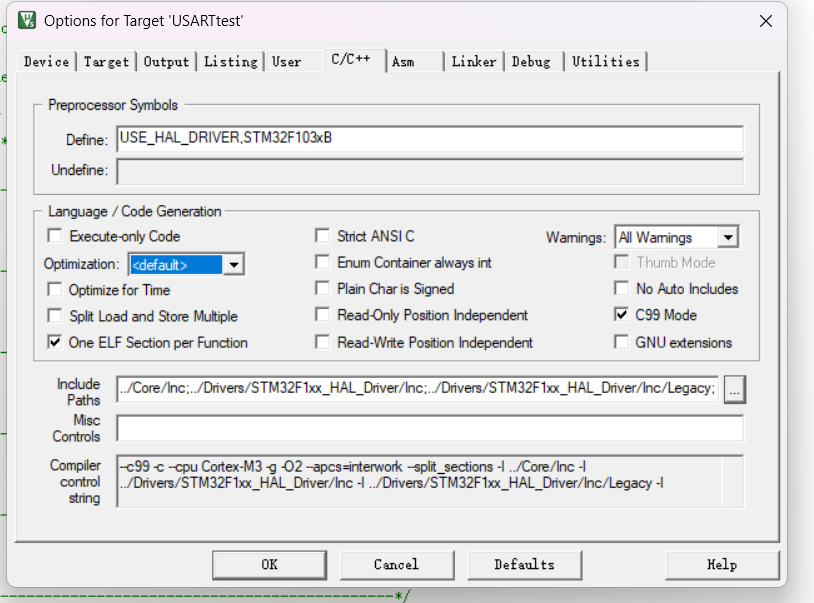

然后编译

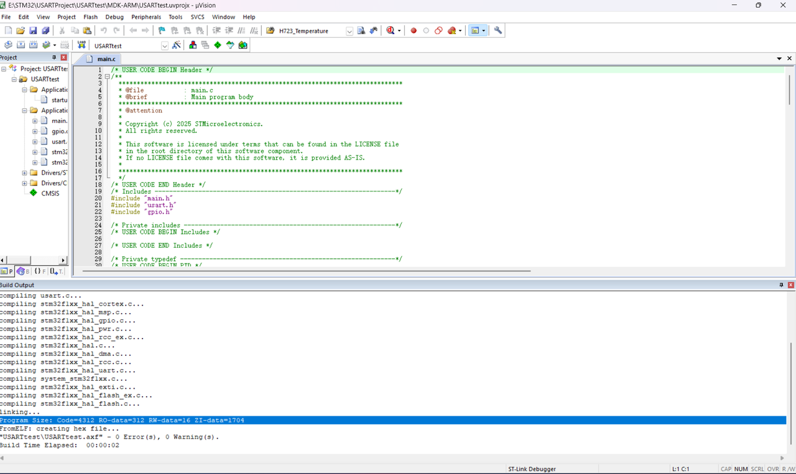

没有问题就可以正常编译代码；

有问题的话：推荐解决方法

浏览器搜索：CSDN，然后在csdn里面搜索自己的问题

浏览器搜索Ai工具像：deepseek,腾讯元宝，豆包，然后输入自己的问题

### **HAL库UART函数库介绍**

#### **1、串口发送/接收函数**

-   HAL_UART_Transmit();串口发送数据，使用超时管理机制

-   HAL_UART_Receive();串口接收数据，使用超时管理机制

-   HAL_UART_Transmit_IT();串口中断模式发送

-   HAL_UART_Receive_IT();串口中断模式接收

-   HAL_UART_Transmit_DMA();串口DMA模式发送

-   HAL_UART_Transmit_DMA();串口DMA模式接收


这几个函数的参数基本都是一样的，我们挑两个讲解一下

```C
HAL_UART_Transmit(UART_HandleTypeDef *huart, uint8_t *pData, uint16_t Size, uint32_t Timeout)
```

功能：串口发送指定长度的数据。如果超时没发送完成，则不再发送，返回超时标志（HAL_TIMEOUT）。

参数：

-   UART_HandleTypeDef \*huart UATR的别名 如 : UART_HandleTypeDef huart1; 别名就是huart1

-   \*pData 需要发送的数据

-   Size 发送的字节数

-   Timeout 最大发送时间，发送数据超过该时间退出发送


```C
举例：   
HAL_UART_Transmit(&huart1, (uint8_t *)ZZX, 3, 0xffff);   //串口发送三个字节数据，最大传输时间0xffff
HAL_UART_Receive_IT(UART_HandleTypeDef *huart, uint8_t *pData, uint16_t Size)
```

功能：串口中断接收，以中断方式接收指定长度数据。

大致过程是，设置数据存放位置，接收数据长度，然后使能串口接收中断。接收到数据时，会触发串口中断。

再然后，串口中断函数处理，直到接收到指定长度数据，而后关闭中断，进入中断接收回调函数，不再触发接收中断。(只触发一次中断)

参数：

-   UART_HandleTypeDef \*huart UATR的别名 如 : UART_HandleTypeDef huart1; 别名就是huart1

-   \*pData 接收到的数据存放地址

-   Size 接收的字节数


```HTML
举例：    HAL_UART_Receive_IT(&huart1,(uint8_t *)&value,1);   //中断接收一个字符，存储到value中
```

#### **2、串口中断函数**

-   HAL_UART_IRQHandler(UART_HandleTypeDef \*huart); //串口中断处理函数

-   HAL_UART_TxCpltCallback(UART_HandleTypeDef \*huart); //串口发送中断回调函数

-   HAL_UART_TxHalfCpltCallback(UART_HandleTypeDef \*huart); //串口发送一半中断回调函数（用的较少）

-   HAL_UART_RxCpltCallback(UART_HandleTypeDef \*huart); //串口接收中断回调函数

-   HAL_UART_RxHalfCpltCallback(UART_HandleTypeDef \*huart);//串口接收一半回调函数（用的较少）

-   HAL_UART_ErrorCallback();串口接收错误函数


==**串口接收中断回调函数：**==

```C
HAL_UART_RxCpltCallback(UART_HandleTypeDef *huart);  
```

功能：HAL库的中断进行完之后，并不会直接退出，而是会进入中断回调函数中，用户可以在其中设置代码，

串口中断接收完成之后，会进入该函数，该函数为空函数，用户需自行修改，

参数：

UART_HandleTypeDef \*huart  	 UATR的别名 如 : UART_HandleTypeDef huart1; 别名就是huart1

```C
举例：   HAL_UART_RxCpltCallback(&huart1){           //用户设定的代码               }
```

**串口中断处理函数**

```C
HAL_UART_IRQHandler(UART_HandleTypeDef *huart);  
```

功能：对接收到的数据进行判断和处理 **判断是发送中断还是接收中断**，然后进行数据的发送和接收，在中断服务函数中使用

如果接收数据，则会进行接收中断处理函数

3.串口查询函数

**HAL_UART_GetState**(); 判断UART的接收是否结束，或者发送数据是否忙碌

举例：

```C
while(HAL_UART_GetState(&huart4) == HAL_UART_STATE_BUSY_TX)   //检测UART发送结束
```

**USART接收与发送**

**重新定义printf函数**

包含

#include \<stdio.h\>

/\* USER CODE BEGIN Includes \*/

\#include \<stdio.h\>

/\* USER CODE END Includes \*/


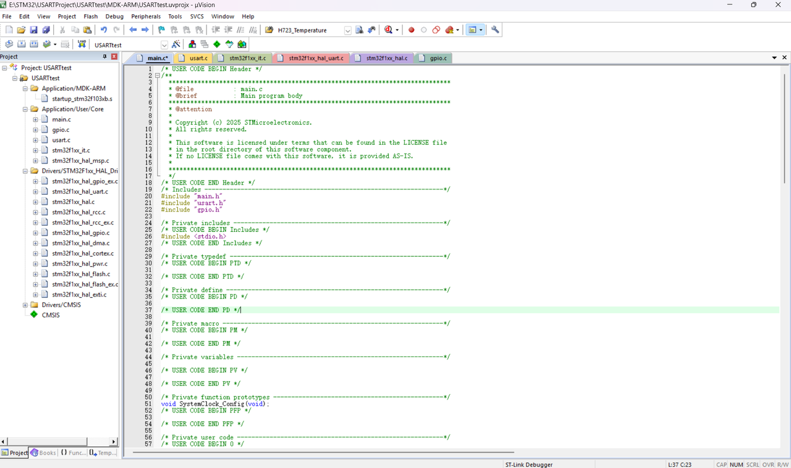

勾选Use MicroLIB

.png)

/\* Private user code ---------------------------------------------------------\*/

/\* USER CODE BEGIN 0 \*/

**在这重写fgett函数**

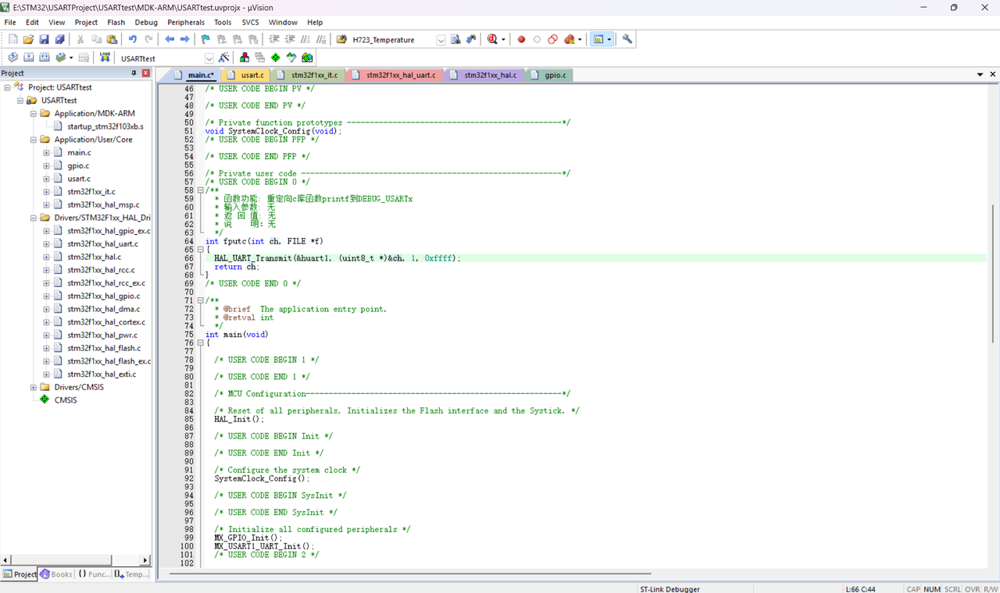

/\* USER CODE END 0 \*/


在主循环添加测试代码

.png)

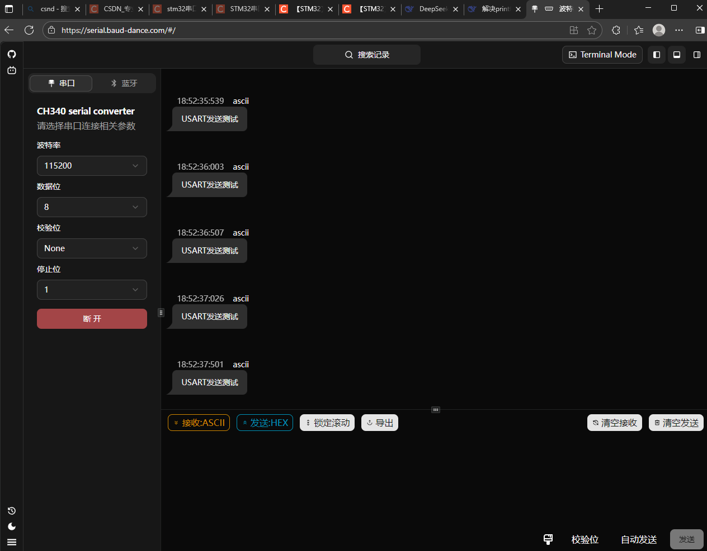

可以看到上位机接收我们发送到的数据

注意：一开始使用这个可能会乱码，需要更改中文编码设置

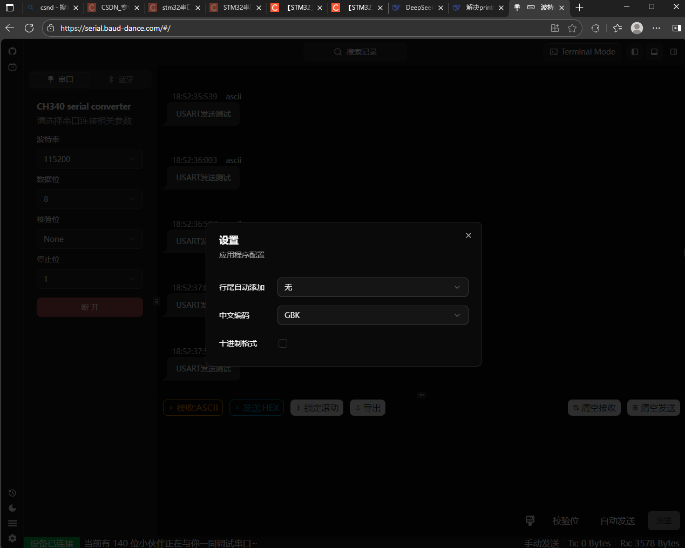

**UART接收中断**

**因为中断接收函数只能触发一次接收中断，所以我们需要在中断回调函数中再调用一次中断接收函数**

1、初始化串口

2、在main中第一次调用接收中断函数

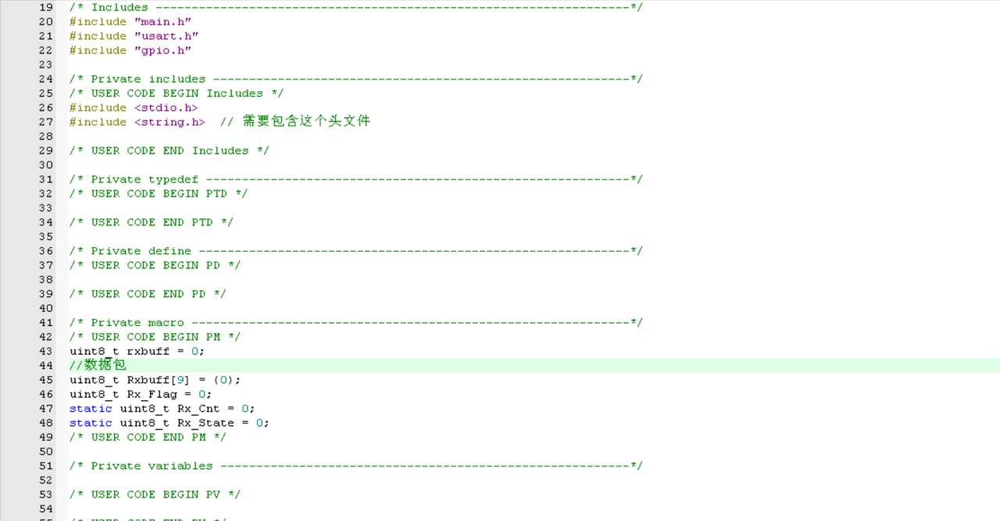

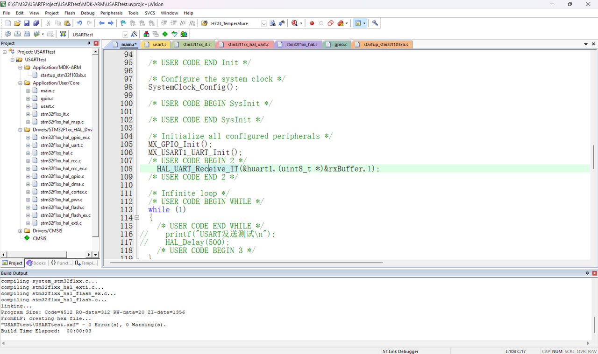

3、进入接收中断，接收完数据 进入中断回调函数

4、修改HAL_UART_RxCpltCallback中断回调函数，处理接收的数据，

5 回调函数中要调用一次HAL_UART_Receive_IT函数，使得程序可以重新触发接收中断

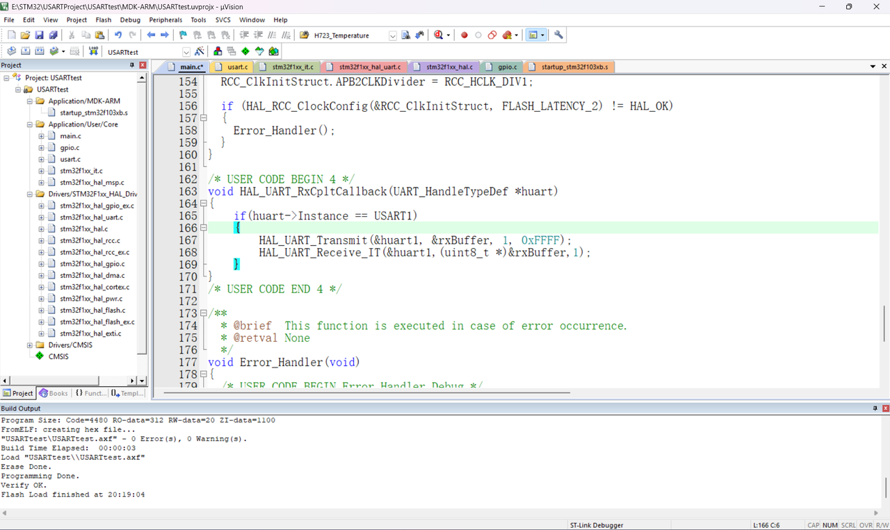

上位机发送信息

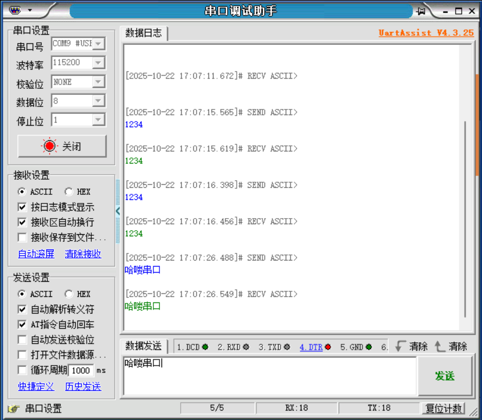

**数据包**

一般互相通信，通常会选择制定一个数据包来发送和解析

格式：  
\[包头\] \[数据区\] \[包尾\]  
(其中包头、数据区、包尾的总长度是固定的)

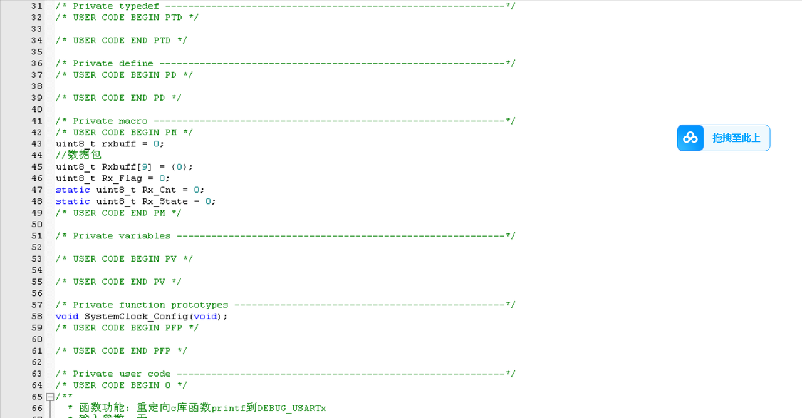

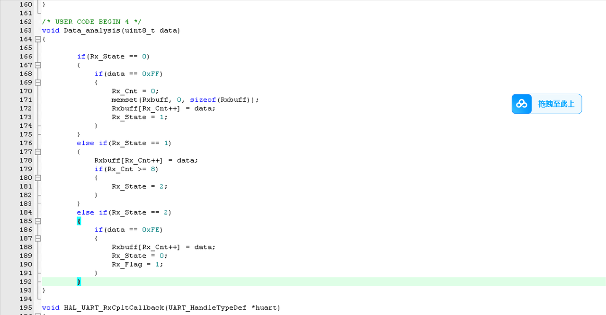

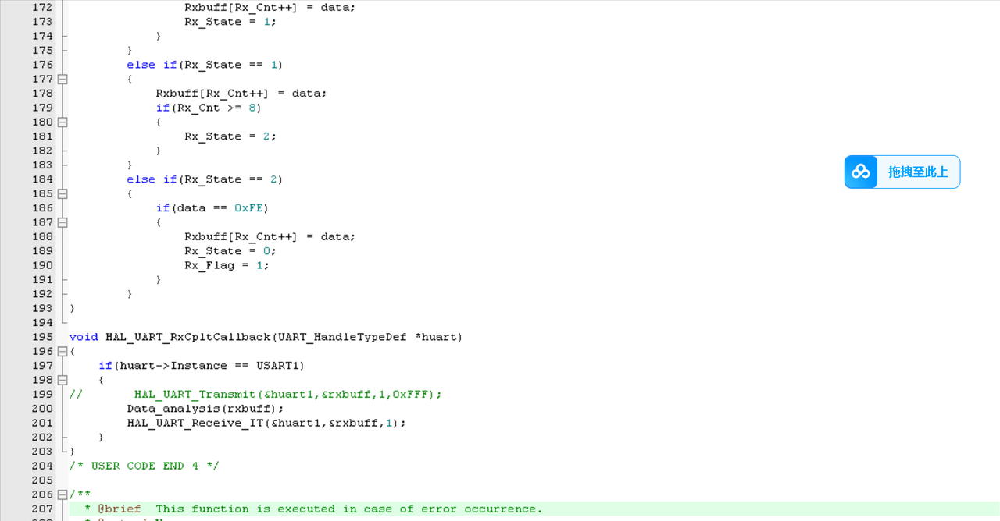

看看效果

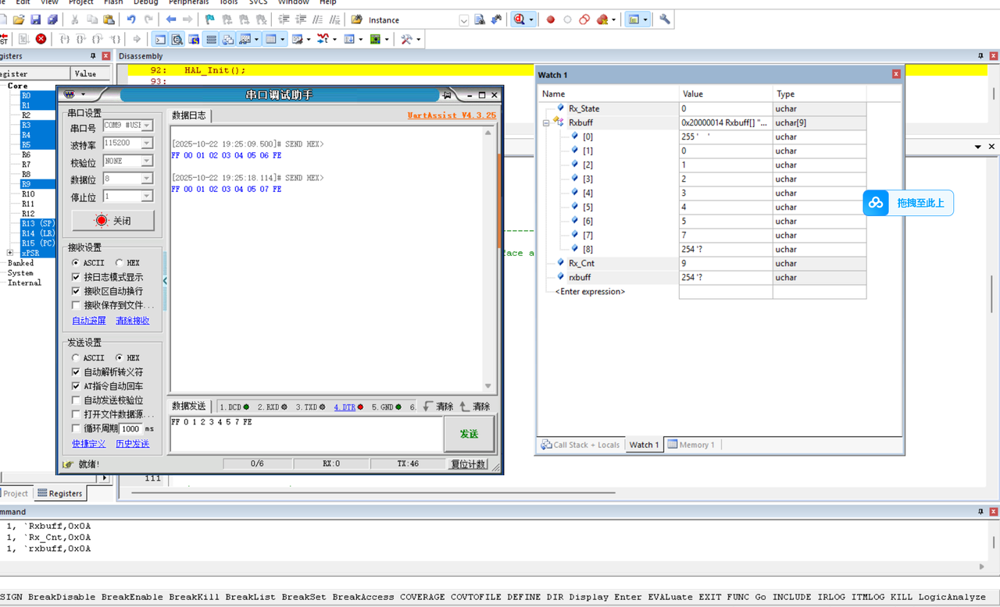
