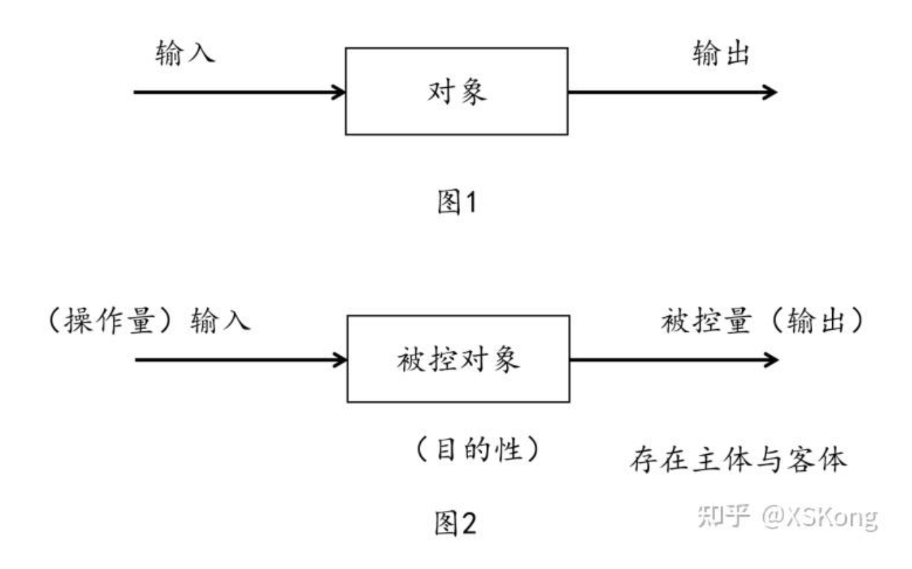
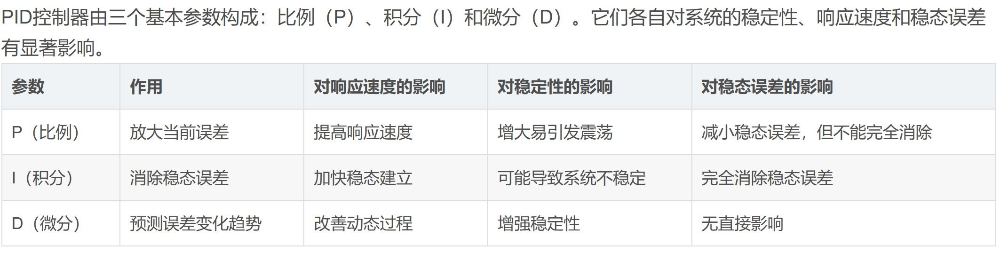

# 4.1PID控制算法理论

## 1.什么是控制，为什么要控制

这里不做学术上的解释，控制可以简单被理解为让被控对象达成我们想要的动作。

大家校内赛去驱动电机，输入不同的占空比，就是为了让电机输出一定的转速，但是由于一些其他的原因（机械装配阻力，轮子在地面上打滑），导致我们可能输入的是一个期望值(ref)，但其实电机转动的速度（measure）并不是我们期望的速度，这就导致了误差（error），上述的控制方式被称为开环控制[^1]，而不同的控制算法就是为了尽量减少误差。

PS:为了给大家提供编程思路，上面这些期望值等我会用ref等英文代替。



这里仅介绍最基础的控制算法PID，还有其他的控制算法例如LQR，MPC，还需大家自己探索

## 2.理解PID

PID三个字母已经把这个算法的核心全盘托出，P->比例kp,I->积分ki，D->微分项kd,这三个参数会对误差做不同的处理，然后输出各自的out以弥补测量值和期望值之间的误差。


整个流程如上整个系统框图所示，输入就是ref，你可以看到有个加号，说明他是正值输入系统，还可以看到测量元件的输出measure是负值，于是我们得到error=（ref-measure）。然后得到error后，你可以看到其作为下一级的输入，输入到三个调节器中做不同处理，你大可以理解这三个调节器是并联的，并且你可以通过编程选择开启其中的某条通路，最后三个调节器的输出相加作为执行机构的输入。（公式与调节器相对应）

### 比例调节器Kp

比例调节器的输出是Kp*error，假设你输入的电机ref为1000，但是测量器件得到的measure为800，那么此调节器的输出就是200 *kp，这个特性也注定，这个参数是三个调节器最重要的部分，他是补充误差的大哥，一般来说补充误差最多的就是比例调节器。

### 积分调节器Ki

但是从上述控制是不足够，你是不是以为将kp设为1，然后输出正好是误差的值，这样整个系统就变成非常完美了。但是从工程上来讲，影响因素太多，这种理想状态不太可能存在，并且在大多数的工况下，我们不可能只是用单环PID，可能是多个PID级联（PID环的输入和输出物理意义不同），典型例子如（外环角度环，内环速度环），多环PID都是后话。所以就算我们将比例调节器的输出结果输入到电机中，我们还是无法保证其的测量值measure就是1000，比例调节器只是减少了误差。

综上，我们引入了积分调节器Ki，用于进一步减小误差，他的输出值是对误差的积分，假如第一个单片机运行周期内其误差是200，第二个是100，那么其输出就是ki * （200+100）这样，这样这个pid公式就进化为
$$
u=kp*error+ ki∗∫ error
$$
于加入了积分项的存在，会让输入增大，从而使得速度慢慢接近ref,这就是积分项的作用。

### 微分调节器

误差的微分就是误差的变化速率，误差变化越快，其微分绝对值越大。误差增大时，其微分为正;误差减小时，其微分为负。控制器输出量的微分部分与误差的微分成正比，反映了被控量变化的趋势。微分作用可以缩短过渡过程和减小动差。但因为它不能消除偏差，所以微分作用不能单独使用，而是同比例积分等组成联合动作的调节器。加入微分调节器是为减小超调现象

### 总结



## 3.PID算法的实现思路

### 硬件需求

==带有编码器的电机（与不同电机来讲，其可以提供测量值）==

### 软件思路

先弄清我们需要哪些变量，根据原理，我们需要很多数据，不如我们使用结构体去构造一个PID的实例。那么我们需要指导结构体里面要有哪些变量。

```
typedef struct
{
	float ref;   //目标值
	float err;          //偏差值
	float err_last;     //上一个偏差值
	float Kp,Ki,Kd;     //比例、积分、微分系数
	float integral;     //积分值
	float output_val;   //输出值

} PIDInstance;
```

有了这个就可对各个pid实例进行操作了，即实现PID算法

```
float PID_realize(float actual_val)
{
	/*计算目标值与实际值的误差*/
	pid.err = pid.target_val - actual_val;
	
	/*积分项*/
	pid.integral += pid.err;

	/*PID算法实现*/
	pid.output_val = pid.Kp * pid.err + 
				     pid.Ki * pid.integral + 
				     pid.Kd * (pid.err - pid.err_last);

	/*误差传递*/
	pid.err_last = pid.err;

	/*返回当前实际值*/
	return pid.output_val;
}

```

## 4.调整pid参数

对于电控来说，这个会是最痛苦的环节，在这里没有太多经验介绍，因为该怎么调上网一搜都有，但是只有自己亲手调过，才能真的有所收获

但是肯定的是，这个必须要有上位机图像化调参才是非常科学的，实现思路可以通过串口转发数据到电脑上位机，或者是使用stm32cubemonitor实时监控

## 参考资料

【1】[(99+ 封私信 / 74 条消息) PID控制算法原理（抛弃公式，从本质上真正理解PID控制） - 知乎](https://zhuanlan.zhihu.com/p/39573490)

【2】[(99+ 封私信 / 76 条消息) 详解PID调节的基本概念、参数与调试方法，清晰易懂！ - 知乎](https://zhuanlan.zhihu.com/p/344721219)

【3】[电机控制进阶——PID速度控制_电机 pid 算法-CSDN博客](https://blog.csdn.net/hbsyaaa/article/details/117003801)

【4】[使用stm32实现电机的PID控制_stm32pid控制电机-CSDN博客](https://blog.csdn.net/weixin_43811044/article/details/127956227)

[^1]: 开环控制是一种无反馈的控制方式，其特点是控制信号单向作用于被控对象，无法根据输出结果进行调整。

