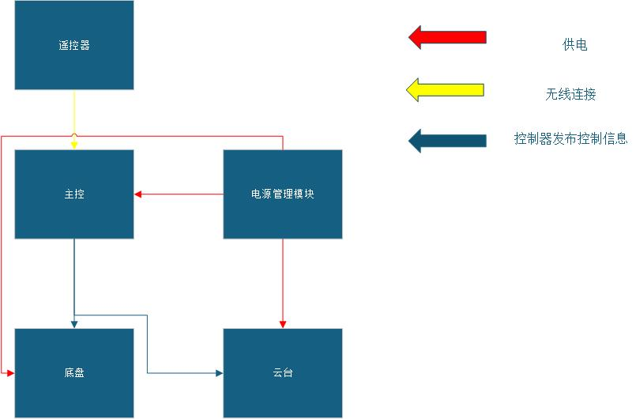

# 电控校内赛思路梳理

# 目录

1.  [电控校内赛物料准备](#电控校内赛物料准备)
2.  [校内赛电控能力梳理](#电控能力梳理)
3.  [电控小车电控系统组成和思路分享](#电控小车电控系统组成和思路分享（时间规划建议）)
4.  ...

# 电控校内赛物料准备

主控：STM32系列单片机；

电源管理模块：[电池](https://item.taobao.com/item.htm?spm=a1z0d.6639537%2F202410.item.d674871474861.135b7484CXJGu8&id=674871474861&from=cart&skuId=5716429053601&mi_id=0000CqM7x0oG4pzMUuQymIWZCAFRtb3spZZX2Hndac0_9oI)，[电池盒](https://item.taobao.com/item.htm?spm=a1z0d.6639537%2F202410.item.d674516788156.135b7484CXJGu8&id=674516788156&from=cart&skuId=4852548372735&mi_id=0000AEtH7Fsbxi6bzw1ml341xXAz2Ryp8Ay6GJEI5LJmnW4&upStreamPrice=1180)（注意买三个装的电池盒，电池就要是3个），[充电器](https://item.taobao.com/item.htm?spm=a1z0d.6639537%2F202410.item.d719629212664.135b7484CXJGu8&id=719629212664&from=cart&skuId=5014962188071&mi_id=0000fXdRhAqz8QlcOciCGatG0QRzuetU4hEuonXcISyhVoU&upStreamPrice=380)，[电压转换模块](https://item.taobao.com/item.htm?spm=a1z0d.6639537%2F202410.item.d536310438933.135b7484CXJGu8&id=536310438933&from=cart&mi_id=0000w-tGt0ZQlKF0anq4OyhSU_6Zo_I9houBRykaP5L7eoE&upStreamPrice=260)，[开关](https://item.taobao.com/item.htm?id=606566402220&ns=1&abbucket=16&xxc=taobaoSearch&mi_id=0000kCpmC_tHO37hiIYYnKfi7kJTY1GFcoGLXDnHPGnlMbE&skuId=5529379302625&utparam=%7B%22aplus_abtest%22%3A%22770770e70aa500a58943ce6eda74173f%22%7D&spm=a21n57.1.hoverItem.2)；

遥控系统：[蓝牙模块](https://item.taobao.com/item.htm?spm=a1z0d.6639537%2F202410.item.d583256341221.135b7484CXJGu8&id=583256341221&from=cart&skuId=4093882605218&mi_id=000082uEifqnkRegMVkWOV4SGKLADawt9k3_u7yX6lm4jYM&upStreamPrice=780)；

底盘：[电机](https://item.taobao.com/item.htm?spm=a1z0d.6639537%2F202410.item.d522572025351.135b7484CXJGu8&id=522572025351&from=cart&mi_id=0000l3Qn2jcWIyQEun1m-f9wiC8NOnXaUxZXqwhqcjjh5pM&upStreamPrice=360)；[电机驱动模块](https://item.taobao.com/item.htm?spm=a1z0d.6639537%2F202410.item.d714923229079.135b7484CXJGu8&id=714923229079&from=cart&mi_id=0000l77qole2U4xgwhNjLkdym7mlTUgbXsUiO2svG-9eI74&upStreamPrice=680)（注意一个驱动芯片最多只能控制两个电机）（具体数量请与机械商量）

云台（射击或者抓矿的结构）：同底盘，[舵机](https://item.taobao.com/item.htm?spm=a1z0d.6639537%2F202410.item.d678498890304.135b7484CXJGu8&id=678498890304&from=cart&skuId=4891585889748&mi_id=0000ogyWUK7ta32GkC4uCkSdS06iQc9rITOplVuVCQ_-GIA&upStreamPrice=432)；

==PS：注意电压转换模块的负载能力，有时挂载外设过多时，超出模块额定电流，会出现一些失常的现象==

# 电控能力梳理

### 焊接与布线能力

包括并且不限于可以自主焊接排针到最小系统板；可以自主焊接杜邦线与电机进行连接。

可以完成整辆车的电气连接，做到安全，稳定,不影响机械结构的正常运动。

==PS：注意电压转换模块的负载能力，有时挂载外设过多时，超出模块额定电流，会出现一些失常的现象==

杜邦线与杜邦线连接和杜邦线与电机端子焊接处必须使用电工胶带包裹

#### 硬件连接参考

小车在电控方面可以分为主控，电源管理模块，底盘和云台模块。

主要电气连接原理图如上。

PS：请提前估计最小系统板上的资源和实际功能之间的关系，如果最小系统板

### 代码能力

#### 外设驱动能力（底层）

可以驱动小车上所有所需外设，包括串口可以正常收发信息（UART串口通信）并且主控拥有接受遥控器信息处理（状态机）的能力，电机可以正常的进行开环控制（PWM控制）等；

#### 驱动外设完成各种功能的能力

使用手机端蓝牙终端发送数据控制小车完成具体行动；通过控制底盘四个电机的转向和转速来控制小车整体的运动方向和速度；控制云台电机或者舵机完成取矿或者射击能力。

（这一部分建立在外设驱动的基础上，是电控的最终任务）

#### 软件设计结构建议图

### 团队交流能力

作为一个队伍的成员，我们要和机械队员及时交流，互相沟通，了解小车的整体设计，了解机械结构具体需要电机怎么转才能达到机构的功能。

# 电控小车电控系统组成和思路分享（时间规划建议）

## 第一阶段（在机械队友出实物之前）推荐ddl:11月10日前

1.  尽量完成所有所需外设的驱动，串口的接收，电机的驱动；
2.  做好代码储备和基础代码框架的构建，为了机械完成实物组装后可以直接上手调；

## 第二阶段（机械队友出了实物就调）推荐ddl:这个看机械队友，但尽量11月末之前

1.  机械队友出了实物就赶紧调，出什么调什么，底盘，云台哪个快调哪个；
2.  这个阶段需要完成小车的部分功能，比如底盘运动，云台射击或者抓矿等宏观上的功能

## 第三阶段 完成整车的调试（优化阶段）

1.  在这一阶段应该将整车调试完毕，小车可以完成计划中的大部分任务和功能
2.  在这一阶段，你应该不断去优化小车的各种性能，包括控制是否灵敏，运动速度是否快，整个系统是否稳定等。

